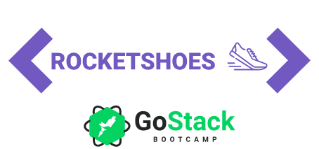

<h1 align="center">
    
    <br>
    React Native RocketShoes
</h1>

<h4 align="center">
  NetShoes Clone App with React Native and Redux.
</h4>

<p align="center">
  <a href="https://ambegossi.com">
    
  </a>

  

  

  <a href="https://github.com/ambegossi/rocketshoes-mobile/commits/master">
    
  </a>

  <a href="https://github.com/ambegossi/rocketshoes-mobile/issues">
    
  </a>

  <a href="https://github.com/ambegossi/rocketshoes-mobile/blob/master/LICENSE.md">
  
  </a>

  <a href="https://github.com/ambegossi/rocketshoes-mobile/stargazers">
    
  </a>
</p>

<p align="center">
  <a href="https://www.codacy.com/manual/ambegossi/rocketshoes-mobile?utm_source=github.com&amp;utm_medium=referral&amp;utm_content=ambegossi/rocketshoes-mobile&amp;utm_campaign=Badge_Grade" target="_blank">
    
  </a>
</p>

<p align="center">
  <a href="#about">About</a>&nbsp;&nbsp;&nbsp;|&nbsp;&nbsp;&nbsp;
  <a href="#rocket-technologies">Technologies</a>&nbsp;&nbsp;&nbsp;|&nbsp;&nbsp;&nbsp;
  <a href="#information_source-how-to-use">How To Use</a>&nbsp;&nbsp;&nbsp;|&nbsp;&nbsp;&nbsp;
  <a href="#memo-license">License</a>
</p>

## About

[GoStack Bootcamp Challenge 7 🚀👨🏻‍🚀](https://github.com/Rocketseat/bootcamp-gostack-desafio-07)

<p align="center">
  
</p>

## :rocket: Technologies

This project was developed at the [RocketSeat GoStack Bootcamp](https://rocketseat.com.br/bootcamp) with the following technologies:

- [ReactJS](https://reactjs.org/)
- [Redux](https://redux.js.org/)
- [Redux-Saga](https://redux-saga.js.org/)
- [React Navigation](https://reactnavigation.org/)
- [Axios](https://github.com/axios/axios)
- [Immer](https://github.com/immerjs/immer)
- [NumeralJS](http://numeraljs.com/)
- [styled-components](https://www.styled-components.com/)
- [react-native-vector-icons](https://github.com/oblador/react-native-vector-icons)
- [react-native-shimmer-placeholder](https://github.com/tomzaku/react-native-shimmer-placeholder)
- [react-native-linear-gradient](https://github.com/react-native-community/react-native-linear-gradient)
- [Reactotron](https://infinite.red/reactotron)
- [VS Code][vc] with [EditorConfig][vceditconfig] and [ESLint][vceslint]

## :information_source: How To Use

To clone and run this application, you'll need [Git](https://git-scm.com), [Node.js v10.16][nodejs] or higher + [Yarn v1.13][yarn] or higher installed on your computer. From your command line:

```bash
# Clone this repository
$ git clone https://github.com/ambegossi/rocketshoes-mobile

# Go into the repository
$ cd rocketshoes-mobile

# Install dependencies
$ yarn install

# Run the app (iOS)
$ react-native run-ios --simulator="iPhone XS Max"

# Run the app (Android)
$ react-native run-android
```

## :memo: License

This project is under the MIT license. See the [LICENSE](LICENSE.md) for more information.

---

Made with ♥ by Anderson Begossi :wave: [Get in touch!](https://www.linkedin.com/in/anderson-begossi-b5065a130)

[nodejs]: https://nodejs.org/
[yarn]: https://yarnpkg.com/
[vc]: https://code.visualstudio.com/
[vceditconfig]: https://marketplace.visualstudio.com/items?itemName=EditorConfig.EditorConfig
[vceslint]: https://marketplace.visualstudio.com/items?itemName=dbaeumer.vscode-eslint
